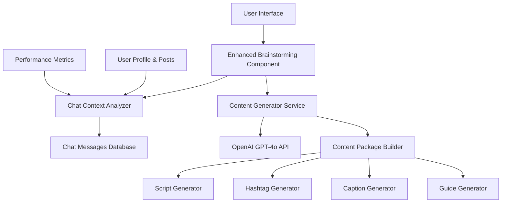

# Design Document

## Overview

The AI Content Generator with Chat Context enhances the existing "freies Brainstorming mit deinem ki assistenten" function by transforming it into an intelligent, context-aware content generation system. The system will analyze recent chat messages to understand user context and generate comprehensive content packages including scripts, hashtags, captions, and implementation guides.

## Architecture

### High-Level Architecture



### System Components

1. **Enhanced UI Component** - Clean, professional interface replacing current brainstorming function
2. **Chat Context Analyzer** - Analyzes recent chat messages for topics, themes, and user style
3. **Content Generator Service** - Orchestrates content generation using analyzed context
4. **Content Package Builder** - Assembles complete content packages with all components
5. **Performance Integration** - Uses existing performance metrics for content optimization

## Components and Interfaces

### 1. Enhanced Brainstorming Interface

**Location**: `app/components/content-ideas.tsx` (modification of existing component)

**Key Features**:
- Clean, professional design with improved typography and spacing
- Loading states with progress indicators
- Organized content sections (script, hashtags, captions, guide)
- Copy-to-clipboard functionality for each section
- Regeneration capabilities

**Interface Structure**:
```typescript
interface EnhancedBrainstormingProps {
  onContentGenerated: (content: ContentPackage) => void;
  onError: (error: string) => void;
}

interface ContentPackage {
  script: string;
  hashtags: string[];
  captions: string[];
  implementationGuide: string;
  visualGuidance: string;
  metadata: {
    generatedAt: Date;
    contextSummary: string;
    userStyle: string;
    topics: string[];
  };
}
```

### 2. Chat Context Analyzer

**Location**: `lib/chat-context-analyzer.ts` (new service)

**Responsibilities**:
- Retrieve recent chat messages (last 30 days or 50 messages)
- Extract key topics, themes, and context
- Identify user communication style and preferences
- Generate context summary for content generation

**Interface**:
```typescript
interface ChatContextAnalyzer {
  analyzeUserContext(userId: string): Promise<UserContext>;
  extractTopics(messages: ChatMessage[]): string[];
  identifyUserStyle(messages: ChatMessage[]): UserStyle;
  generateContextSummary(context: UserContext): string;
}

interface UserContext {
  topics: string[];
  themes: string[];
  userStyle: UserStyle;
  recentInterests: string[];
  communicationPatterns: CommunicationPattern[];
  contextSummary: string;
}
```

### 3. Enhanced Content Generator Service

**Location**: `lib/enhanced-content-generator.ts` (new service)

**Responsibilities**:
- Use chat context for personalized content generation
- Generate comprehensive content packages
- Maintain user voice and style consistency
- Provide regeneration capabilities

**Interface**:
```typescript
interface EnhancedContentGenerator {
  generateContentPackage(
    userContext: UserContext,
    prompt?: string
  ): Promise<ContentPackage>;
  
  regenerateContent(
    previousPackage: ContentPackage,
    userContext: UserContext
  ): Promise<ContentPackage>;
  
  optimizeForPlatform(
    content: ContentPackage,
    platform: SocialPlatform
  ): ContentPackage;
}
```

### 4. Content Package Builder

**Location**: `lib/content-package-builder.ts` (new service)

**Responsibilities**:
- Assemble complete content packages
- Generate scripts with proper structure
- Create relevant hashtags based on context
- Generate engaging captions
- Provide implementation guides

## Data Models

### Enhanced Content Package Model

```typescript
interface ContentPackage {
  id: string;
  userId: string;
  script: {
    title: string;
    hook: string;
    mainContent: string;
    callToAction: string;
    duration: string;
  };
  hashtags: {
    primary: string[];
    secondary: string[];
    trending: string[];
    niche: string[];
  };
  captions: {
    short: string;
    medium: string;
    long: string;
    story: string;
  };
  implementationGuide: {
    steps: string[];
    tips: string[];
    bestPractices: string[];
    timing: string;
  };
  visualGuidance: {
    composition: string[];
    lighting: string[];
    editing: string[];
    style: string;
  };
  metadata: {
    generatedAt: Date;
    contextSummary: string;
    userStyle: string;
    topics: string[];
    confidence: number;
  };
}
```

### User Context Model

```typescript
interface UserContext {
  userId: string;
  topics: string[];
  themes: string[];
  userStyle: {
    tone: 'professional' | 'casual' | 'friendly' | 'authoritative';
    vocabulary: 'simple' | 'technical' | 'mixed';
    length: 'concise' | 'detailed' | 'varied';
  };
  recentInterests: string[];
  communicationPatterns: {
    questionTypes: string[];
    responsePreferences: string[];
    engagementStyle: string;
  };
  performanceData: {
    bestPerformingTopics: string[];
    avgEngagement: number;
    preferredFormats: string[];
  };
  contextSummary: string;
  analyzedAt: Date;
}
```

## Error Handling

### Error Types and Responses

1. **Authentication Errors**
   - Missing or invalid authentication
   - Return 401 with clear error message
   - Redirect to login if necessary

2. **Context Analysis Errors**
   - Insufficient chat history
   - Fallback to generic content generation
   - Inform user about limited context

3. **Content Generation Errors**
   - OpenAI API failures
   - Retry mechanism with exponential backoff
   - Fallback to cached templates

4. **Database Errors**
   - Chat message retrieval failures
   - Graceful degradation with error logging
   - User notification with retry option

### Error Recovery Strategies

```typescript
interface ErrorRecoveryStrategy {
  retryWithBackoff(operation: () => Promise<any>, maxRetries: number): Promise<any>;
  fallbackToGeneric(userPrompt: string): Promise<ContentPackage>;
  cacheFailureRecovery(cacheKey: string): Promise<ContentPackage | null>;
}
```

## Testing Strategy

### Unit Testing

1. **Chat Context Analyzer Tests**
   - Topic extraction accuracy
   - User style identification
   - Context summary generation
   - Edge cases (empty history, single message)

2. **Content Generator Tests**
   - Content package completeness
   - Style consistency
   - Regeneration functionality
   - Platform optimization

3. **UI Component Tests**
   - Loading states
   - Error handling
   - Copy functionality
   - Regeneration flow

### Integration Testing

1. **End-to-End Content Generation**
   - Full flow from chat analysis to content package
   - Multiple user scenarios
   - Performance under load

2. **API Integration Tests**
   - OpenAI API integration
   - Database operations
   - Authentication flow

### Performance Testing

1. **Response Time Benchmarks**
   - Chat analysis: < 5 seconds
   - Content generation: < 15 seconds
   - UI responsiveness: < 100ms interactions

2. **Load Testing**
   - Concurrent user scenarios
   - Database query optimization
   - API rate limiting

## Implementation Approach

### Phase 1: Core Infrastructure
- Implement Chat Context Analyzer
- Create Enhanced Content Generator Service
- Set up data models and interfaces

### Phase 2: Content Generation
- Build Content Package Builder
- Implement script, hashtag, caption, and guide generators
- Add regeneration capabilities

### Phase 3: UI Enhancement
- Replace existing brainstorming interface
- Implement clean, professional design
- Add loading states and error handling

### Phase 4: Integration & Testing
- Integrate all components
- Comprehensive testing
- Performance optimization

### Technical Considerations

1. **Performance Optimization**
   - Cache frequently used context data
   - Implement request debouncing
   - Optimize database queries

2. **User Experience**
   - Progressive loading for better perceived performance
   - Clear feedback during generation process
   - Intuitive copy-to-clipboard functionality

3. **Scalability**
   - Efficient chat message retrieval
   - OpenAI API rate limiting
   - Database connection pooling

4. **Security**
   - Proper authentication validation
   - Input sanitization
   - Rate limiting for API calls