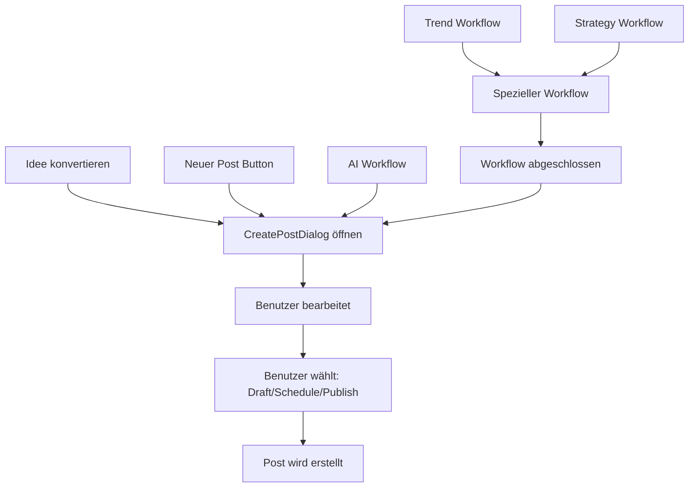

# Content Hub Post Creation Guide

## 🎯 **Post Creation Workflow - Verhindert ungewollte Post-Erstellung**

### **Problem gelöst:**
- ❌ Posts wurden automatisch beim Ideen-Konvertieren erstellt
- ❌ AI-Planung erstellte direkt geplante Posts
- ❌ Workflows erstellten Duplikate
- ❌ Keine Benutzerbestätigung vor Post-Erstellung

### **Neue sichere Workflow:**

## 1. **Ideen zu Posts konvertieren**

**VORHER:**
```typescript
// ❌ SCHLECHT - Post sofort erstellt
await actions.addPost({ ... }) // Direkte Erstellung
```

**NACHHER:**
```typescript
// ✅ GUT - Öffnet Create-Dialog
setConvertingIdeaContent(prefilledContent)
setIsCreatePostOpen(true)
// Post wird erst nach Benutzerbestätigung erstellt
```

**Workflow:**
1. Benutzer klickt "Idee zu Post konvertieren"
2. **CreatePostDialog** öffnet sich mit vorgefülltem Inhalt
3. Benutzer kann bearbeiten, Plattformen wählen, Zeitplan setzen
4. **Erst bei "Speichern/Planen/Posten" wird Post erstellt**

## 2. **AI-Planung**

**VORHER:**
```typescript
// ❌ SCHLECHT - Posts direkt als 'scheduled' erstellt
status: 'scheduled',
scheduled_for: suggestedDate
```

**NACHHER:**
```typescript
// ✅ GUT - Posts als Entwürfe erstellt
status: 'draft',
suggested_date: suggestedDate, // Nur Vorschlag
metadata: { ai_suggestion: true }
```

**Workflow:**
1. AI erstellt **nur Entwürfe**, keine geplanten Posts
2. Benutzer muss jeden Entwurf **manuell überprüfen**
3. Benutzer entscheidet: Bearbeiten → Planen → Posten

## 3. **Duplikat-Verhinderung**

**Implementiert in `addPost()`:**
```typescript
// Prüft auf ähnliche Posts in letzten 5 Minuten
const potentialDuplicate = Object.values(state.posts).find(existingPost => 
  existingPost.content === post.content &&
  JSON.stringify(existingPost.platforms.sort()) === JSON.stringify(post.platforms.sort()) &&
  (now - new Date(existingPost.createdAt).getTime()) < duplicateThreshold
)

if (potentialDuplicate) {
  toast.error('Ein ähnlicher Beitrag wurde kürzlich erstellt.')
  return // Verhindert Duplikat
}
```

## 4. **Workflow-Übersicht**

### **Alle Post-Erstellungspfade führen durch CreatePostDialog:**



## 5. **Sicherheitsmaßnahmen**

### **✅ Implementierte Schutzmaßnahmen:**

1. **Keine sofortige Post-Erstellung**
   - Alle Wege führen durch CreatePostDialog
   - Benutzerbestätigung erforderlich

2. **Duplikat-Verhinderung**
   - Gleicher Inhalt + Plattformen in 5min = blockiert
   - Warnung für Benutzer

3. **AI-Entwürfe statt geplante Posts**
   - AI erstellt nur Vorschläge
   - Manuelle Genehmigung erforderlich

4. **Ideen-Status-Tracking**
   - Verhindert mehrfache Konvertierung
   - `isImplemented` Flag prüfung

5. **Benutzerfreundliche Fehlerbehandlung**
   - Deutsche Fehlermeldungen
   - Klare Benutzerführung

## 6. **Verwendung**

### **Für Entwickler:**

```typescript
// ✅ Richtig - Immer durch Dialog
const handleCreateFromIdea = (idea) => {
  setConvertingIdeaContent({
    title: idea.title,
    description: idea.description,
    hashtags: idea.hashtags
  })
  setIsCreatePostOpen(true)
}

// ❌ Falsch - Nie direkt erstellen
const handleCreateFromIdea = async (idea) => {
  await actions.addPost({ ... }) // NICHT TUN!
}
```

### **Für Benutzer:**

1. **Ideen konvertieren:** Klick → Dialog öffnet sich → Bearbeiten → Speichern
2. **AI-Planung:** Klick → Entwürfe erstellt → Entwürfe-Tab → Einzeln überprüfen
3. **Neue Posts:** Button → Dialog → Erstellen

## 7. **Testen**

### **Testszenarios:**

1. ✅ Idee konvertieren → Dialog öffnet sich
2. ✅ AI-Planung → Nur Entwürfe erstellt
3. ✅ Gleichen Post 2x erstellen → Duplikat-Warnung
4. ✅ Workflow abbrechen → Kein Post erstellt
5. ✅ Post speichern → Erst dann in DB

### **Erwartetes Verhalten:**
- **Keine automatischen Posts**
- **Alle Erstellungen gehen durch CreatePostDialog**
- **Benutzer hat volle Kontrolle**
- **Klare Feedback-Meldungen**

## 8. **Debugging**

Wenn Posts ungewollt erstellt werden:

1. Prüfe Console auf `addPost()` Aufrufe
2. Suche nach direkten `PostsService.createPost()` Aufrufen
3. Stelle sicher alle Wege führen durch `CreatePostDialog`
4. Prüfe `isImplemented` Flags bei Ideen

---

**✅ Resultat: Sichere, benutzerfreundliche Post-Erstellung ohne Überraschungen!** 